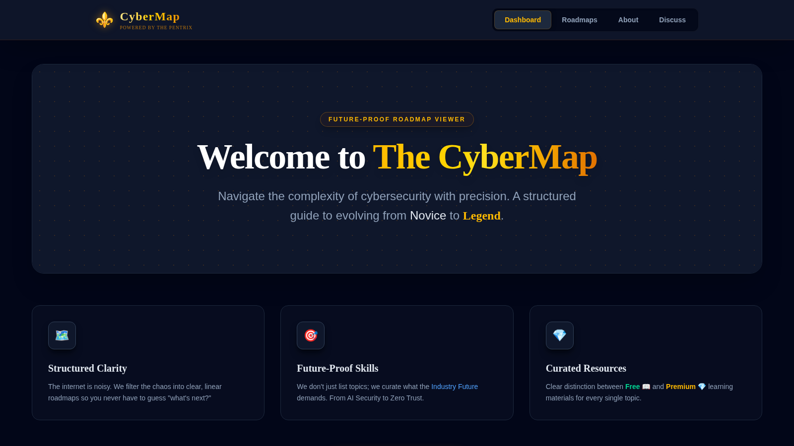
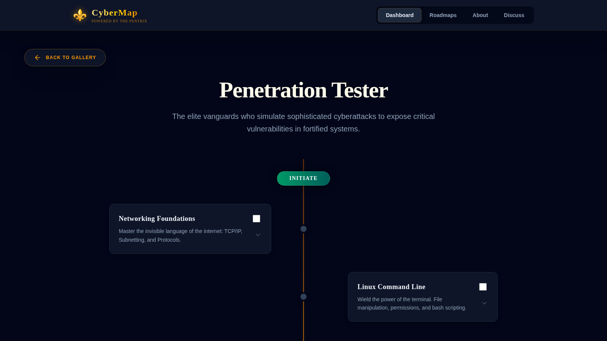

<div align="center">

# 🗺️ CyberMap

### **Navigate Your Cybersecurity Journey from Novice to Legend**

[](https://cyber-map-six.vercel.app/)
[](https://github.com/mizazhaider-ceh/CyberMap)
[](https://cyber-map-six.vercel.app/)
[](https://cyber-map-six.vercel.app/)

*"The internet is noisy. We filter the chaos into clear, linear roadmaps so you never have to guess 'what's next?'"*

[**🚀 Explore Roadmaps**](https://cyber-map-six.vercel.app/) • [**📖 Documentation**](#-features) • [**🤝 Contribute**](#-contributing)

</div>

---

## 🎯 The Problem

Every aspiring cybersecurity professional faces the same questions:

❓ *"Should I become a Pentester or a SOC Analyst?"*  
❓ *"What certifications actually matter?"*  
❓ *"How do I go from beginner to expert?"*  
❓ *"Which resources are worth my time and money?"*

The answer? **It depends.**

But nobody tells you *what* it depends on.

---

## ✨ The Solution: CyberMap

**CyberMap** is an interactive, offline-first Progressive Web App that provides **structured learning roadmaps** for **18+ specialized cybersecurity career paths**.

Instead of drowning in scattered tutorials, you get:

✅ **Clear career paths** - Know exactly where you're going  
✅ **Skill progression** - INITIATE → ADEPT → MASTER → LEGEND  
✅ **Curated resources** - Free 🟦 and Premium 🔷 labeled transparently  
✅ **Future-proof skills** - AI Security, Zero Trust, Cloud Native  
✅ **Offline access** - Learn anywhere, even without internet  

---

## 🎬 See It In Action

<div align="center">

### Landing Page
*Navigate complexity with precision*



### Roadmap Detail
*Visual learning paths from Initiate to Legend, with checkable progress*



[**→ Try CyberMap Now**](https://cyber-map-six.vercel.app/)

</div>

---

## 🛤️ Available Career Roadmaps

<table>
<tr>
<td width="33%" valign="top">

### 🔴 Offensive Security
- **Penetration Tester**  
  *Simulate attacks, expose vulnerabilities*
- **Bug Bounty Hunter**  
  *Find bugs, get paid*
- **Red Team Operator**  
  *Advanced adversary simulation*

</td>
<td width="33%" valign="top">

### 🛡️ Defensive Security
- **Blue Team Defender**  
  *Detect, respond, protect*
- **SOC Analyst**  
  *24/7 threat monitoring*
- **Digital Forensics**  
  *Investigate cyber crimes*
- **Incident Response**  
  *Handle breaches like a pro*

</td>
<td width="33%" valign="top">

### ☁️ Cloud & AppSec
- **Cloud Security Engineer**  
  *Secure AWS, Azure, GCP*
- **AppSec Engineer**  
  *Build secure software*
- **DevSecOps**  
  *Automate security in CI/CD*

</td>
</tr>
</table>

<table>
<tr>
<td width="33%" valign="top">

### 🏗️ Architecture & GRC
- **Security Architect**  
  *Design enterprise security*
- **GRC Analyst**  
  *Governance, Risk, Compliance*

</td>
<td width="33%" valign="top">

### 🤖 Emerging Domains
- **AI Security Engineer**  
  *Offensive & defensive AI*
- **AI in Cybersecurity**  
  *ML for threat detection*
- **ICS/OT Security**  
  *Protect critical infrastructure*

</td>
<td width="33%" valign="top">

### 🎓 Fundamentals
- **Certification Path**  
  *Industry credentials*
- **Cyber Fundamentals**  
  *Networking, OS, security*
- **Programming for Cyber**  
  *Python, Bash, automation*
- **Success Mindset**  
  *Mental resilience*

</td>
</tr>
</table>

---

## 🚀 Key Features

| Feature | Description |
|---------|-------------|
| 🗺️ **18+ Career Paths** | Comprehensive roadmaps covering offensive, defensive, governance, and emerging domains |
| 📊 **4-Tier Progression** | INITIATE → ADEPT → MASTER → LEGEND with clear learning milestones |
| 🎯 **Curated Resources** | Handpicked courses, certifications, tools, and labs |
| 🟦🔷 **Free vs Premium** | Transparent labeling so you know what's free and what's paid |
| 📱 **Progressive Web App** | Install on any device, works offline after first load |
| ⚡ **Lightning Fast** | Service worker caching for instant load times |
| 🌙 **Dark Mode Native** | Easy on the eyes during late-night learning sessions |
| 📲 **Mobile Optimized** | Seamless experience on desktop, tablet, and mobile |

---

## 💻 Tech Stack

**Built with simplicity and performance in mind:**

```javascript

Frontend:        Vanilla HTML5, CSS3, JavaScript (ES6+)
Styling:         Custom CSS with Flexbox \& CSS Grid
PWA:             Service Worker + Web App Manifest
Caching:         Cache-first strategy with network fallback
Icons:           Custom SVG illustrations
Deployment:      Vercel (primary) + GitHub Pages (backup)
Version Control: Git + GitHub

```

**Why Vanilla JS?**  
- ⚡ Zero framework overhead = faster load times
- 🔒 No dependency vulnerabilities
- 📦 Smaller bundle size
- 🛠️ Future-proof (will work 10 years from now)

---

## 🏗️ Project Structure

```

CyberMap/
├── 📄 index.html              \# Main application entry
├── 🎨 assets/css/style.css    \# Global styles & theme
├── 🎨 assets/css/tailwind.css  \# Pre-compiled Tailwind (offline-first, no CDN)
│                                 Regenerate: npx @tailwindcss/cli -i .tw-input.css -o assets/css/tailwind.css
│                                 (.tw-input.css contains: @import "tailwindcss";)
├── ⚙️ script.js               \# Routing, roadmaps, interactions
├── 🔧 sw.js                   \# Service Worker (offline magic)
├── 📱 manifest.json           \# PWA configuration
├── 📁 assets/                 \# Images, icons, visuals
└── 📖 README.md               \# You are here!

```


---

## 🎮 Getting Started

### Option 1: Use It Now (Recommended)

Just visit: **[https://cyber-map-six.vercel.app/](https://cyber-map-six.vercel.app/)**

That's it. No installation, no setup.

---

### Option 2: Install as Native App

**On Mobile (iOS/Android):**
1. Visit [CyberMap](https://cyber-map-six.vercel.app/)
2. Tap browser menu
3. Select **"Add to Home Screen"**
4. Open from your home screen like any other app

**On Desktop (Chrome/Edge):**
1. Visit [CyberMap](https://cyber-map-six.vercel.app/)
2. Look for install icon in address bar
3. Click **"Install"**
4. Launch from your apps menu

---

---

## 🎓 Philosophy: Why CyberMap Exists

### The PenTrix Mission

> *"Security is not a product, but a process. Trust the journey, master the basics."*

**CyberMap** is part of **The PenTrix** - a platform dedicated to sharing practical cybersecurity insights with aspiring hackers, defenders, and security engineers.

### Our Principles

1. **🎯 Structured > Random** - Linear roadmaps beat scattered tutorials
2. **🔮 Future-proof > Trendy** - Principles over tools, foundations over fads
3. **🔓 Open Knowledge** - Elite resources shouldn't be gatekept
4. **💪 Continuous Growth** - From novice to master, one skill at a time

---

## 👤 About the Founder

<div align="center">

### Muhammad Izaz Haider
**Founder & Architect | The PenTrix**

*18-year-old Junior DevSecOps & AI Security Engineer*  
*Howest University Student | Damno Solutions*

</div>

**The Journey:**  
From the rustic streets of a Pakistani village 🇵🇰 to the high-tech cybersecurity hubs of Belgium 🇧🇪. My path was forged in 9th grade with a single, dangerous curiosity:

> *"How do systems break?"*

Today, I answer that question by building intelligent, unbreakable defenses.

**Current Mission:**  
Pioneering the fusion of Generative AI with cybersecurity to engineer adaptive defense systems that evolve faster than threats.

**Core Philosophy:**  
*"If I fail, the failure is mine. If I succeed, the credit belongs to Allah alone."*

**Connect:**  
[](https://linkedin.com/in/muhammad-izaz-haider)
[](https://github.com/mizazhaider-ceh)
[](mailto:muhammad.izahaider@damno-solutions.be)

---

## 🤝 Contributing

CyberMap is a **living project**. The cybersecurity landscape evolves, and so should our roadmaps.

### How You Can Contribute

- 🗺️ **Add new roadmaps** - Suggest career paths we're missing
- 🔗 **Recommend resources** - Share quality courses, tools, or certifications
- 🐛 **Report bugs** - Help us improve the experience
- 🌍 **Translate** - Make CyberMap accessible in your language
- ⭐ **Star the repo** - Show your support!

### Contribution Process

1. **Fork** the repository
2. **Create a branch**: `git checkout -b feature/new-roadmap`
3. **Make your changes** to `script.js` (roadmap data structure)
4. **Test locally** to ensure everything works
5. **Submit a Pull Request** with a clear description

We review PRs within 48 hours!

---

## 🗓️ Roadmap (Development)

### ✅ v1.0 - Foundation (Current)
- [x] 18+ career path roadmaps
- [x] Skill progression system (4 tiers)
- [x] Free vs Premium resource labeling
- [x] PWA with offline support
- [x] Mobile responsive design
- [x] Founder profile integration

### 🚧 v2.0 - Interactivity (Q1 2026)
- [ ] User progress tracking (localStorage)
- [ ] Bookmark/favorite resources
- [ ] Search functionality across all roadmaps
- [ ] Dark/Light theme toggle
- [ ] Community discussion forum

### 🔮 v3.0 - Intelligence (Q2 2026)
- [ ] AI-powered personalized learning paths
- [ ] Skill gap analysis
- [ ] Mentor matching system
- [ ] Real-world project integration
- [ ] Certification exam tracker

### 🌟 v4.0 - Ecosystem (Future)
- [ ] Job board integration
- [ ] Interview preparation modules
- [ ] Gamification (badges, achievements)
- [ ] Multi-language support (Urdu, Arabic, French)
- [ ] Export roadmaps as PDF

---

## 📊 Project Stats

<div align="center">


[](https://github.com/mizazhaider-ceh/CyberMap/issues)
[](https://github.com/mizazhaider-ceh/CyberMap/pulls)
[](LICENSE)

</div>

---

## 📜 License

This project is licensed under the **MIT License** - see the [LICENSE](LICENSE) file for details.

**Open Source. Knowledge belongs to the ambitious.**

---

## 🙏 Acknowledgments

- **The Cybersecurity Community** - for endless knowledge sharing
- **Howest University** - for world-class security education
- **Damno Solutions** - for real-world engineering experience
- **Allah (SWT)** - for guidance and opportunity

---

## 💬 Support & Feedback

If CyberMap helped you on your cybersecurity journey:

- ⭐ **Star this repository**
- 🔗 **Share with fellow security enthusiasts**
- 💬 **Open an issue** for suggestions or bugs
- 🤝 **Connect on LinkedIn** for mentorship

---

## 🔗 Related Projects

- 🧠 **[Archetypes](https://github.com/mizazhaider-ceh/Archetypes)** - Strategic wisdom archive for defenders
- 🛡️ **[The PenTrix](https://github.com/mizazhaider-ceh)** - More security tools and resources

---

<div align="center">

### 🌟 Star History

[](https://star-history.com/#mizazhaider-ceh/CyberMap&Date)

</div>

---

<div align="center">

**Built with ☕, curiosity, and late-night coding sessions.**

*"Cybersecurity is a journey of endless curiosity. Don't rush to be a 'hacker'—strive to be a Master of Foundations. The tools will change, but the principles remain. Trust the process, and never stop learning."*

**— Muhammad Izaz Haider**

---

**Alhamdulillah | In Sha Allah | Bismillah**

---

<sub>© 2025 The PenTrix. All rights reserved.</sub>

[](https://cyber-map-six.vercel.app/)

</div>


